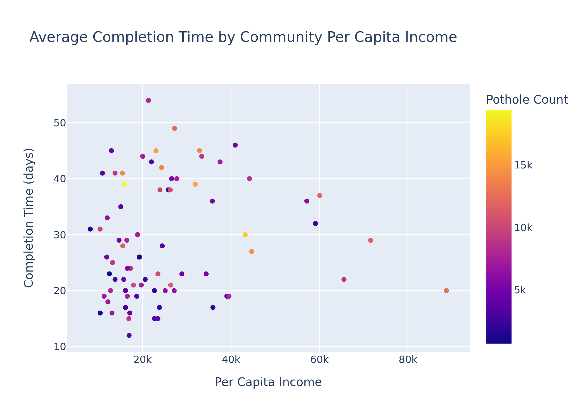
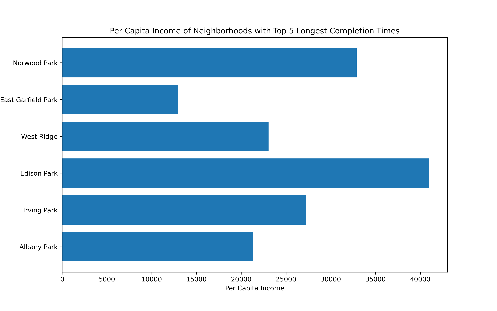
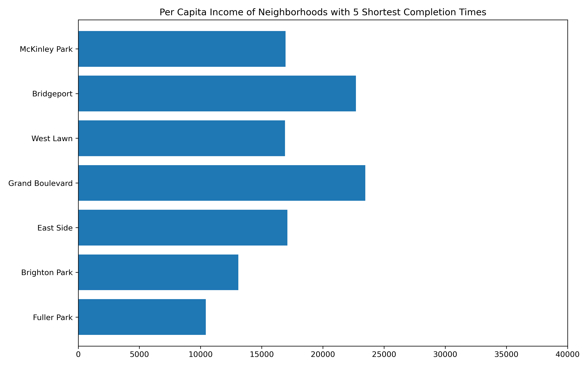

# Chicago Potholes Data (2011 - 2017) or some better title
Requirements for reporting your analysis:

The goal of the analysis is must be clearly articulated
The report must include your methodology
The report must include a description of your project and its findings (or lack of findings)
Your findings (or non-findings) must be clearly documented
The limitations of the analysis must be clearly outlined
Extensions of your analysis or areas for more research must be included in your report
You should not include analysis, plots, discoveries, that aren’t directly related to your findings – you can put them as an appendix in another file if you like

## Analysis: Completion Time and Per Capita Income
The code for this part of the analysis can be found [here](code/census-pot.ipynb).
The idea was an exploration of the relationship between pothole completion times and income in Chicago's 77 community zones. First, the `Completion Time` variable was created by subtracting `Creation Date` from `Completion Date`. Then the `potholes` dataset was grouped by `Community Area`, where we calculated the total counts of potholes and the mean completion time of potholes by community area. This data frame was then merged with the `census_data` data frame into a final form `working_data`, which has each community area and community area name along with their per capita incomes, total counts of potholes over the years, and average completion time.

To visualize this analysis, a scatterplot was created with `Per Capita Income` on the x-axis and `Completion Time` on the y-axis .
In the scatterplot, the color scale is by number of potholes, with the darkest points having the fewest number of potholes and the lighest points having the most potholes in that community zone. We see that in areas with the lowest incomes, even having a smaller number of potholes than in richer areas results in a slower average completion time.

In the following two plots, the per capita income of the neighborhoods with the top 5 longest completion times and top 5 shortest completion times are shown. These metrics were calculated by viewing `working_data.head() ` and `working_data.tail()`. It seems that the incomes of neighborhoods with longer completion times are lower, but this analysis does not include other confounding variables, such as the population of each community area. 

